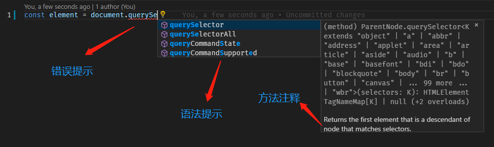

import { CodeSurferLayout } from 'code-surfer';
import { Appear } from 'mdx-deck';
export { nightOwlFull as theme } from 'code-surfer/themes';

# TypeScript 简明教程

---

TypeScript 是什么？

## TypeScript 是 JavaScript + 类型声明，它可以编译成纯 JavaScript。



---

<CodeSurferLayout >

```shell title="开始使用 TypeScript"  subtitle="通过ts-lib-scripts创建一个用来练习的 TypeScript 项目"

npx ts-lib-scripts create ts-hello-world

```

</CodeSurferLayout>

---

<CodeSurferLayout>

```ts 1,3 title="基础类型" subtitle="布尔值"
let isDone: boolean = fasle;

isDone = 2; // Error,不能将类型"2"分配给类型“boolean”
```

```ts 1,2,3,4 title="基础类型" subtitle="数字"
const decLiteral: number = 6;
const hexLiteral: number = 0xf00d;
const binaryLiteral: number = 0b1010;
const octalLiteral: number = 0o744;
```

```ts 1,2 title="基础类型" subtitle="字符串"
let name: string = 'bob';
name = 'smith';
```

```ts 1 title="基础类型" subtitle="数组: 可以在元素类型后面接上[]，表示由此类型元素组成的一个数组"
let list: number[] = [1, 2, 3];
```

```ts 1 title="基础类型" subtitle="数组: 使用数组泛型，Array<元素类型>定义"
let list: Array<number> = [1, 2, 3];
```

```ts 2,4,5 title="元组"
// 定义元祖类型
let x: [string, number];
// 初始化
x = ['hello', 10]; // OK
x = [10, 'hello']; // 错误，类型不匹配
```

```ts 5 title="元组" subtitle="输出什么？"
let x: [string, number];
x = ['hello', 10]; // OK
x = [10, 'hello']; // 错误，类型不匹配

console.log(x[0].substr(1));
```

```ts 5 title="元组" subtitle="ello"
let x: [string, number];
x = ['hello', 10]; // OK
x = [10, 'hello']; // 错误，类型不匹配

console.log(x[0].substr(1));
```

```ts 6 title="元组" subtitle="输出什么？"
let x: [string, number];
x = ['hello', 10]; // OK
x = [10, 'hello']; // 错误，类型不匹配

console.log(x[0].substr(1));
console.log(x[1].substr(1));
```

```ts 6 title="元组" subtitle="错误, 'number'类型没有'substr'方法"
let x: [string, number];
x = ['hello', 10]; // OK
x = [10, 'hello']; // 错误，类型不匹配

console.log(x[0].substr(1));
console.log(x[1].substr(1));
```

```ts 1 title="any" subtitle="有时候，我们会想要为那些在编程阶段还不清楚类型的变量指定一个类型,  我们不希望类型检查器对这些值进行检查而是直接让它们通过编译阶段的检查,就可以指定any"
let notSure: any = 4;
notSure = 'maybe a string instead';
notSure = false;
```

```ts title="void" subtitle="某种程度上来说，void类型像是与any类型相反，它表示没有任何类型。当一个函数没有返回值时，我们通常会把返回值的类型设为void"
function fn(): void {
  console.log('这是一个函数类型声明');
}
```

```ts title="null和undefined" subtitle="和void相似，它们的本身的类型用处不是很大。默认情况下null和undefined是所有类型的子类型"
let u: undefined = undefined;
let n: null = null;
```

</CodeSurferLayout>

---

<CodeSurferLayout>

```ts 1,2,3,4,5 title="枚举" subtitle="使用枚举我们可以定义一些带名字的常量，可以清晰地表达意图或创建一组有区别的用例"
enum Color {
  Red,
  Green,
  Blue,
}
const c: Color = Color.Green;
```

```ts 2 title="枚举" subtitle="默认情况下，从0开始为元素编号。 你也可以手动的指定成员的数值"
enum Color {
  Red = 1,
  Green,
  Blue,
}
const c: Color = Color.Green;
```

```ts 2,3,4 title="枚举" subtitle="全部都采用手动赋值"
enum Color {
  Red = 1,
  Green = 2,
  Blue = 4,
}
const c: Color = Color.Green;
```

```ts 8 title="枚举" subtitle="输出什么？"
enum Color {
  Red = 1,
  Green,
  Blue,
}
let colorName: string = Color[2];

console.log(colorName);
```

```ts 8 title="枚举" subtitle="输出'Green',因为从枚举来看，Red值为1，Green值为2，Blue值为3"
enum Color {
  Red = 1,
  Green,
  Blue,
}
let colorName: string = Color[2];

console.log(colorName);
```

</CodeSurferLayout>

---

<CodeSurferLayout>

```ts 1,3,4,6,7,8,9 title="对象" subtitle="object 表示非原始类型，也就是除 number，string，boolean，symbol，null 或 undefined 之外的类型。"
declare function create(o: object | null): void;

create({ prop: 0 }); // OK
create(null); // OK

create(42); // Error
create('string'); // Error
create(false); // Error
create(undefined); // Error
```

</CodeSurferLayout>

---

<CodeSurferLayout>

```ts 3 title="类型断言" subtitle="方式一："尖括号"语法"
const someValue: any = 'this is a string';

const strLength: number = (<string>someValue).length;
```

```ts 3 title="类型断言" subtitle="方式二：as语法"
const someValue: any = 'this is a string';

const strLength: number = (someValue as string).length;
```

</CodeSurferLayout>

---

以上两种类型断言的形式是等价的，至于用哪个，大部分时候看个人喜好。

但是，当在 TypeScript 里使用到 JSX 时，必须使用 as 语法形式的断言。

---

ts 非空断言关键字(!)

!和?是相对的，表示强制解析（也就是告诉 typescript 编译器，这里一定有值）

---

<CodeSurferLayout>

```ts 3 subtitle="tslint检查会报错，原因是element可能为null"
const element = document.querySelector('.item');

console.log(element.getBoundingClientRect());

console.log(element!.getBoundingClientRect());
```

```ts 5 subtitle="如果某个变量的类型为Xxx | null | undefined，但是你确定在用这个变量时它肯定有值，那么你可以使用!来告诉 TypeScript 这个变量不可能为null或undefined。"
const element = document.querySelector('.item');

console.log(element.getBoundingClientRect());

console.log(element!.getBoundingClientRect());
```

</CodeSurferLayout>

---

<CodeSurferLayout>

```ts 1,2,3 title="接口" subtitle="接口可以为对象定义结构信息"
interface Props {
  userName: string;
}

function Hello(props: Props) {
  return <div>Hello, {props.userName}</div>;
}
```

```ts 1,2,3 title="可选属性" subtitle="默认情况下，接口中的属性是必须的，不指定则会提示错误。如果属性不是必需的，则可以用?声明属性为可选属性"
interface SquareConfig {
  color?: string;
  width?: number;
}

function createSquare(config: SquareConfig): { color: string; area: number } {
  let newSquare = { color: 'white', area: 100 };
  if (config.color) {
    newSquare.color = config.color;
  }
  if (config.width) {
    newSquare.area = config.width * config.width;
  }
  return newSquare;
}

let mySquare = createSquare({ color: 'black' });
```

```ts title="只读属性" subtitle="一些对象属性只能在对象刚刚创建的时候修改其值。 你可以在属性名前用 readonly来指定只读属性"
interface Point {
  readonly x: number;
  readonly y: number;
}
```

```ts 1 title="只读属性" subtitle="你可以通过赋值一个对象字面量来构造一个Point。 "
let p1: Point = { x: 10, y: 20 };

p1.x = 5; // error!
```

```ts 3 title="只读属性" subtitle=" 赋值后， x和y再也不能被改变了"
let p1: Point = { x: 10, y: 20 };

p1.x = 5; // error!
```

</CodeSurferLayout>

---

## 函数

---

<CodeSurferLayout>

```js
function add(x, y) {
  return x + y;
}
```

```js 1:3 subtitle="javascript"
function add(x, y) {
  return x + y;
}
```

```ts 1:3 subtitle="typescripot"
function add(x: number, y: number): number {
  return x + y;
}
```

```ts 1 subtitle="给函数参数和返回值赋值"
function add(x: number, y: number): number {
  return x + y;
}
```

```ts
add(1, 2); // OK
add(1, '2'); // error
```

```ts 2 subtitle="ts错误提示："\"2\"不能赋给类型“number”的参数。"
add(1, 2); // OK
add(1, '2'); // error
```
</CodeSurferLayout>

---

### 函数类型

函数作为值传递时的类型声明。

---

<CodeSurferLayout>

```ts
function calc(
  x: number,
  y: number,
  calcFn: ???,
): number {
  return calcFn(x, y);
}
```

```ts 4 subtitle="calcFn的类型怎么声明？"
function calc(
  x: number,
  y: number,
  calcFn: ???,
): number {
  return calcFn(x, y);
}
```

```ts 4 
function calc(
  x: number,
  y: number,
  calcFn: (x: number, y: number) => number,
): number {
  return calcFn(x, y);
}
```

```ts 1:5
function add(x: number, y: number): number {
  return x + y;
}

calc(1, 2, add); // ok
```

```ts 1:5
function pow(x: number, y: number): number {
  return x ** y;
}

calc(1, 2, pow); // ok
```

```ts 1:5
function divide(x: number, y: number): number {
  return x / y;
}

calc(2, 1, divide); // ok
```

```ts 1:5
function sum(x: number, y: number, z: number): number {
  return x + y + z;
}

calc(1, 2, sum); // error
```

</CodeSurferLayout>

---

### 在接口中定义函数类型的参数

---

<CodeSurferLayout>

```ts 1:6 title="方式一"
interface Point {
  readonly x: number;
  readonly y: number;

  distinct(anotherPoint: Point): number;
}
```

```ts 1:6 title="方式一" subtitle="推荐方式"
interface Point {
  readonly x: number;
  readonly y: number;

  distinct(anotherPoint: Point): number;
}
```

```ts 1:6 title="方式二"
interface Point {
  readonly x: number;
  readonly y: number;

  distinct: (anotherPoint: Point) => number;
}
```

</CodeSurferLayout>


---

### 可选的函数参数

---

<CodeSurferLayout>

```ts
function buildName(firstName: string, lastName?: string) {
  return firstName + lastName;
}
```

```ts 1 subtitle="参数后面添加?，表示该参数可选"
function buildName(firstName: string, lastName?: string) {
  return firstName + lastName;
}
```

```ts 
buildName('Bob'); // ok
buildName('Bob', 'Alias'); // ok
buildName('Bob', 'Alias', 'Axx'); // error
```

```ts 1 subtitle="有问题么？"
function buildName(firstName?: string, lastName: string) {
  return firstName + lastName;
}
```

```ts 1 subtitle="可选参数必须在必须参数之后"
function buildName(firstName?: string, lastName: string) {
  return firstName + lastName;
}
```

```ts 1
function buildName(firstName: string | undefined, lastName: string) {
  return firstName + lastName;
}
```

```ts 1 subtitle="一个函数可以有多个可选参数"
function buildName(firstName?: string, lastName?: string) {
  return firstName + lastName;
}
```

```ts 1:4 subtitle="lastName?: string等价于lastName: string | undefined"
function buildName(
  firstName: string | undefined,
  lastName: string | undefined,
) {
  return firstName + lastName;
}
```

</CodeSurferLayout>

---

### 函数参数默认值

可以为可选参数添加上默认值。这样，调用函数时，如果该函数参数为`undefined`，则该参数为默认值。

---

<CodeSurferLayout>

```ts
function buildName(firstName: string, lastName: string = 'Smith') {
  return firstName + lastName;
}

const result1 = buildName('Bob'); // OK, result1 = Bob Smith
const result2 = buildName('Bob', 'Adams'); // OK, result2 = Bob Adams
```

</CodeSurferLayout>

---

## 类

---

<CodeSurferLayout>

```ts
class Animal {
  name: string;

  constructor(theName: string) {
    this.name = theName;
  }

  move(distanceInMeters: number) {
    alert(this.name + 'moved' + distanceInMeters + 'm');
  }
}

const animal = new Animal('Kiki');
```

```ts 2 subtitle="给类的成员属性添加类型"
class Animal {
  name: string;

  constructor(theName: string) {
    this.name = theName;
  }

  move(distanceInMeters: number) {
    alert(this.name + 'moved' + distanceInMeters + 'm');
  }
}

const animal = new Animal('Kiki');
```

```ts 4 subtitle="给构造函数参数添加类型"
class Animal {
  name: string;

  constructor(theName: string) {
    this.name = theName;
  }

  move(distanceInMeters: number) {
    alert(this.name + 'moved' + distanceInMeters + 'm');
  }
}

const animal = new Animal('Kiki');
```


```ts 8 subtitle="给类的成员方法添加类型声明"
class Animal {
  name: string;

  constructor(theName: string) {
    this.name = theName;
  }

  move(distanceInMeters: number) {
    alert(this.name + 'moved' + distanceInMeters + 'm');
  }
}

const animal = new Animal('Kiki');
```

</CodeSurferLayout>

---

<CodeSurferLayout>

```ts title="public 修饰符" subtitle="在TypeScript里，成员都默认为public。也可以明确的将一个成员标记成 public"
class Animal {
  public name: string;
  public constructor(theName: string) {
    this.name = theName;
  }
  public move(distanceInMeters: number) {
    alert(this.name + 'moved' + distanceInMeters + 'm');
  }
}
```

</CodeSurferLayout>

---

<CodeSurferLayout>

```ts 2,8 title="private 修饰符" subtitle="当成员被标记成 private时，它就不能在声明它的类的外部访问"
class Animal {
  private name: string;
  constructor(theName: string) {
    this.name = theName;
  }
}

new Animal('Cat').name; // 错误: 'name' 是私有的.
```

</CodeSurferLayout>

---

<CodeSurferLayout>

```ts  title="protected 修饰符" subtitle="protected修饰符与 private修饰符的行为很相似，但有一点不同， protected成员在派生类中仍然可以访问"
class Person {
  protected name: string;
  constructor(name: string) {
    this.name = name;
  }
}

class Employee extends Person {
  private department: string;

  constructor(name: string, department: string) {
    super(name);
    this.department = department;
  }

  public getElevatorPitch() {
    return (
      'Hello, my name is' + this.name + 'and I work in' + this.department + '.'
    );
  }
}

let howard = new Employee('Howard', 'Sales');
```

```ts 2,25 title="protected 修饰符" subtitle="错误我们不能在 Person类外使用 name"
class Person {
  protected name: string;
  constructor(name: string) {
    this.name = name;
  }
}

class Employee extends Person {
  private department: string;

  constructor(name: string, department: string) {
    super(name);
    this.department = department;
  }

  public getElevatorPitch() {
    return (
      'Hello, my name is' + this.name + 'and I work in' + this.department + '.'
    );
  }
}

let howard = new Employee('Howard', 'Sales');
console.log(howard.getElevatorPitch());
console.log(howard.name); // 错误我们不能在 Person类外使用 name
```

```ts 2,24 title="protected 修饰符" subtitle="我们仍然可以通过 Employee类的实例方法访问，因为 Employee是由 Person派生而来"
class Person {
  protected name: string;
  constructor(name: string) {
    this.name = name;
  }
}

class Employee extends Person {
  private department: string;

  constructor(name: string, department: string) {
    super(name);
    this.department = department;
  }

  public getElevatorPitch() {
    return (
      'Hello, my name is' + this.name + 'and I work in' + this.department + '.'
    );
  }
}

let howard = new Employee('Howard', 'Sales');
console.log(howard.getElevatorPitch());
```

```ts 3,9,24 title="protected 修饰符" subtitle="构造函数也可以被标记成 protected。 这意味着这个类不能在包含它的类外被实例化，但是能被继承"
class Person {
  protected name: string;
  protected constructor(theName: string) {
    this.name = theName;
  }
}

// Employee 能够继承 Person
class Employee extends Person {
  private department: string;

  constructor(name: string, department: string) {
    super(name);
    this.department = department;
  }

  public getElevatorPitch() {
    return (
      'Hello, my name is' + this.name + 'and I work in' + this.department + '.'
    );
  }
}

let howard = new Employee('Howard', 'Sales');
let john = new Person('John'); // 错误: 'Person' 的构造函数是被保护的.
```

</CodeSurferLayout>

---

类型推论

对于能够显而易见的推断出变量类型的，TypeScript 允许我们省略类型声明，这就是类型推论

---

<CodeSurferLayout>

```ts title="类型推论"
let x: number = 0;

x = 1; // OK
x = '1'; // error
```

```ts 1 title="类型推论" subtitle="x被赋值为0，所以我们一般会推测它的类型为number。对于这种显而易见的类型，TypeScript 允许我们省略类型声明"
let x = 0;

x = 1; // OK
x = '1'; // error
```

```jsx 1:10
const x = [0, 1, null];
const zoo = [new Rhino(), new Elephant(), new Snake()];

<button
  onClick={(event) => {
    console.log(event);
  }}
>
  点击我
</button>
```

```jsx 1 title="类型推论" subtitle="x的类型推断为：(number | null)[]"
const x = [0, 1, null];
const zoo = [new Rhino(), new Elephant(), new Snake()];

<button
  onClick={(event) => {
    console.log(event);
  }}
>
  点击我
</button>
```

```jsx 2 title="类型推论" subtitle="zoo类型推断为：(Rhino | Elephant | Snake)[]"
const x = [0, 1, null];
const zoo = [new Rhino(), new Elephant(), new Snake()];

<button
  onClick={(event) => {
    console.log(event);
  }}
>
  点击我
</button>
```

```jsx 5:7 title="类型推论" subtitle="event类型推断为：React.MouseEvent<HTMLButtonElement>"
const x = [0, 1, null];
const zoo = [new Rhino(), new Elephant(), new Snake()];

<button
  onClick={(event) => {
    console.log(event);
  }}
>
  点击我
</button>
```

</CodeSurferLayout>

---

谢谢！！！！

:clap::clap::clap:

🎉🎉🎉

```

```
